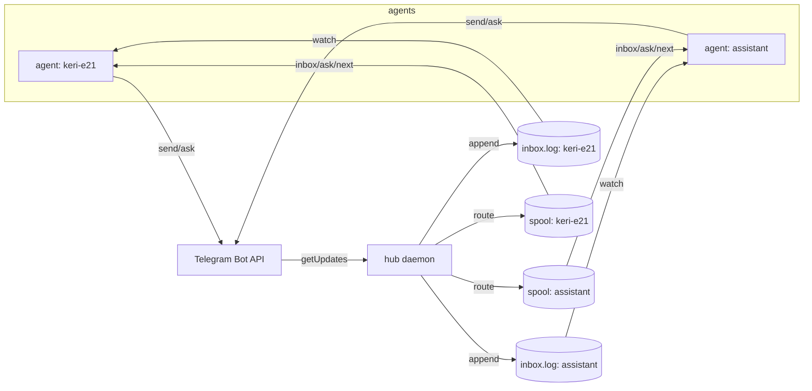
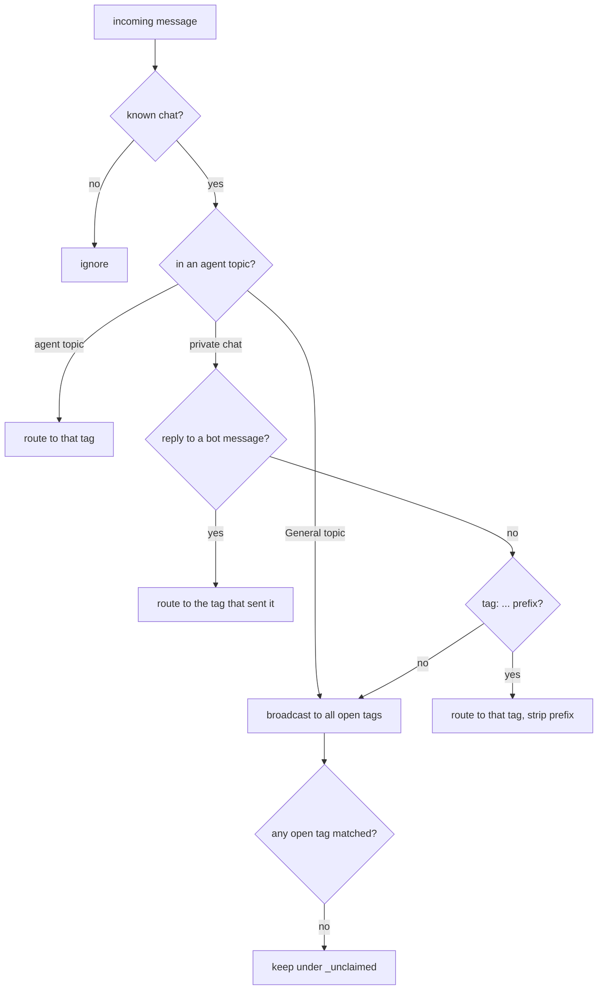
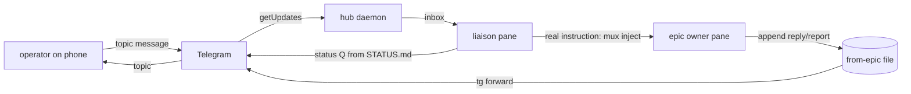

# Architecture

## The hub

Telegram allows exactly one `getUpdates` consumer per bot token, so a
single daemon owns the inbound direction. Every agent's `tg send` posts
directly to Telegram, but only the daemon polls for incoming messages
and routes each one to the agent it belongs to. The daemon is
long-lived and network-resilient: a transient `getUpdates` timeout or
connection error is caught and retried rather than crashing the poller.

Each routed message is written to **two surfaces** for the target tag:

- an **append-only inbox log** (`inbox.log`) — the durable stream an
  agent tails to stay on the channel, and
- a **spool** of one-file-per-message under `inbox/` — the queue that
  `tg inbox`/`tg ask`/`tg next` drain.



## Routing

Each incoming message is assigned to one agent by a fixed precedence,
implemented as a pure function (`Sideband.Route`) so the whole decision
matrix is unit-tested:

1. **Topic** — a message in an agent's forum topic goes to that agent.
   A message in the group's **General** topic broadcasts to all agents.
2. **Reply-to** — in the private chat, a reply to a specific bot
   message routes to the tag that sent it (a sent-message registry).
3. **Tag prefix** — `keri-e21: pause` routes to that tag, prefix
   stripped.
4. Anything else broadcasts; a message that matches no open tag is kept
   under an `_unclaimed` tag rather than dropped, and messages from
   unknown chats are ignored.



## The inbox log — being on the channel

The spool is a queue: reading it (`tg inbox`, `tg ask`, `tg next`)
**consumes** the message. That is the wrong shape for "am I still
listening?", because a slow, idle, or just-restarted agent that isn't
draining would silently miss messages, and two readers race for the
same file.

So every routed message is *also* appended, one flattened line each, to
an **append-only** `inbox.log`. Appending never removes anything:
reading the log is non-destructive, nothing is "eaten", and a restarted
agent re-reads from wherever it left off. **Watching this file is what
being on the channel means.** `tg watch` is simply a `tail -F` of it —
an agent could equally tail the file itself, which is why the mechanism
is fully agent-independent (Claude, Codex, Gemini, or a shell all watch
the same file the same way).

The two surfaces divide cleanly:

| Surface | Command | Semantics |
|---|---|---|
| `inbox.log` | `tg watch` | append-only stream; non-consuming; the presence channel |
| `inbox/` spool | `tg inbox`, `tg ask`, `tg next` | queue; each read consumes; for one-shot drains and blocking receives |

## Voice notes

When the daemon receives a voice (or audio) message and `WHISPER_URL`
is set, it downloads the file, posts it to the whisper-server
`/transcribe` endpoint, and routes the transcription as if it were
text (prefixed with a microphone glyph). Without `WHISPER_URL` the
voice note is dropped with a log line. The whisper-server is pinned to
English so a note is transcribed, not auto-translated.

## Ephemeral channels

A forum topic is created on demand (`tg open`) and closed when the
agent stands down (`tg off` / `tg close`). Closed topics are kept and
reopened on the next `tg open`, so an epic that revives reuses its
channel rather than accumulating dead threads.

## Going mobile — the liaison

When the operator, watching an epic owner in a terminal, wants to leave
and keep talking to it from a phone, the epic owner does **not** start
watching Telegram itself — a turn-based agent can't be woken by a file
mid-task, and polling would distract it from the work. Instead it runs
`go-mobile`, which **spawns a dedicated liaison agent** in a sibling
pane whose only job is the channel, and then returns to work.

The liaison and the epic owner talk over two deliberately different
mechanisms, because the two directions have different constraints:

- **Downward (operator → epic owner): an attention-grab, nothing more.**
  A file can't wake a busy agent, so to deliver a real instruction the
  liaison interrupts the epic owner's pane and injects the text as
  input. This is the *only* place a terminal-multiplexer trick is used,
  and it is wrapped in the `mux` adapter (below) so it isn't tmux-locked.
- **Upward (epic owner → operator): a plain channel file, no
  screen-scraping.** The epic owner appends one line per reply or report
  to a `from-epic` file; the liaison runs `tg forward` on that file,
  relaying each new line to the topic.

The liaison answers status questions itself from the epic owner's
`STATUS.md` and only interrupts the epic owner for genuine instructions,
so the operator gets a responsive channel while the work is disturbed as
little as possible.



## Pluggable multiplexer

The liaison needs exactly two multiplexer operations — spawn a sibling
pane and inject a submitted line into another pane — so those are the
only places anything is multiplexer-specific. Both go through a small
`mux` adapter with four verbs (`self`, `spawn`, `inject`, `focus`); the
backend is chosen by `SIDEBAND_MUX` (default `tmux`). Supporting zellij,
screen, wezterm, or anything else is a matter of dropping one backend
file in and running the conformance test — nothing in the liaison logic
changes. The contract and test live with the skill under
`skills/telegram/scripts/mux-backends/`.

## State on disk

All runtime state lives under the state dir (default
`~/.local/state/sideband`, override `TG_STATE`):

```
tags/<tag>/inbox/<nanos>.msg   spool: one routed message per file
tags/<tag>/inbox.log           append-only stream (the tg watch surface)
tags/<tag>/topic               the tag's forum thread id
tags/<tag>/from-epic           liaison upward channel (go-mobile / tg forward)
sent.idx                       message_id -> tag registry (reply routing)
offset                         last consumed getUpdates offset
daemon.pid                     the running hub's pid
```

Nothing here is secret and nothing is a database — every file is plain
text a human or any tool can read, which is what keeps the channel
agent-independent.
