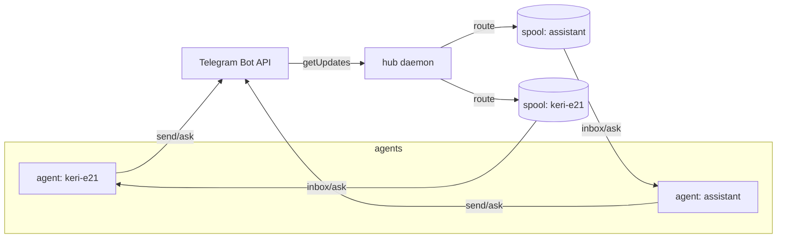

# Architecture

## The hub

Telegram allows exactly one `getUpdates` consumer per bot token, so a
single daemon owns the inbound direction. Every agent's `tg send` posts
directly to Telegram, but only the daemon polls for incoming messages
and routes them to per-agent inbox spools on disk. The commands
(`ask`, `inbox`) read their tag's spool rather than polling.

## Routing

Each incoming message is assigned to one agent by a fixed precedence,
implemented as a pure function (`Sideband.Route`) so the whole decision
matrix is unit-tested:

1. **Topic** — a message in an agent's forum topic goes to that agent.
   A message in the group's **General** topic broadcasts to all agents.
2. **Reply-to** — in the private chat, a reply to a specific bot
   message routes to the tag that sent it (a sent-message registry).
3. **Tag prefix** — `keri-e21: pause` routes to that tag, prefix
   stripped.
4. Anything else broadcasts; messages from unknown chats are dropped.

## Voice notes

When the daemon receives a voice (or audio) message and `WHISPER_URL`
is set, it downloads the file, posts it to the whisper-server
`/transcribe` endpoint, and routes the transcription as if it were
text (prefixed with a microphone glyph). Without `WHISPER_URL` the
voice note is dropped with a log line.

## Ephemeral channels

A forum topic is created on demand (`tg open`) and closed when the
agent stands down (`tg off` / `tg close`). Closed topics are kept and
reopened on the next `tg open`, so an epic that revives reuses its
channel rather than accumulating dead threads.
